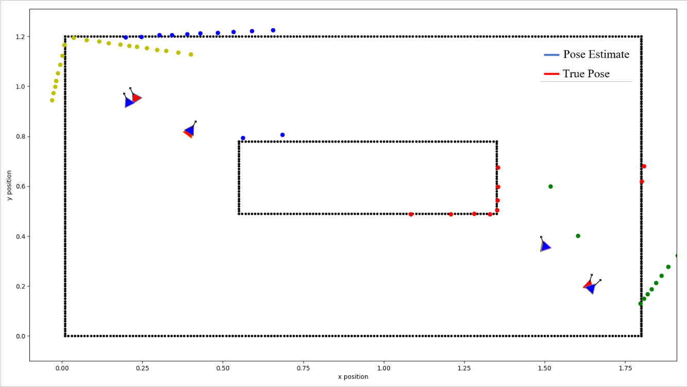

# Project description

- 2D localization for a swarm of milli-robots is simulated in a known environement using inter-robot communication and laser range scans of the environment.
- Extended kalman filter and point-cloud alignment algorithms used in the state estimation process

# System Requirements and Installations

- Operating system: Ubuntu-Melodic 18.04
- Installation of ros-melodic
- Python 2
- Open3d

# Commands to Setup and Run Simulation

- Create catkin workspace and import "stage_ros" and "swarm_localization" catkin packages from repository
- Run "rosrun stage_ros stageros src/stage_ros/world/simple.world" command in terminal to start world simulation
- Run "rosrun map_server map_server src/stage_ros/world/test.yaml" command to setup occupancy grid map node
- Run "rosrun swarm method_testing.py" command to implement localization

# Simulation Results

